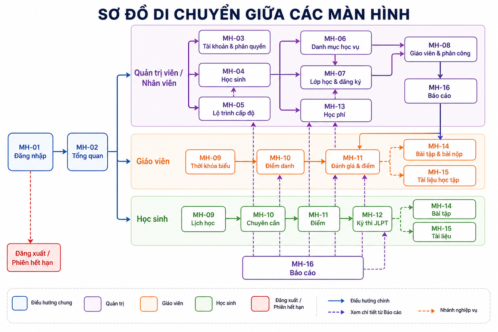
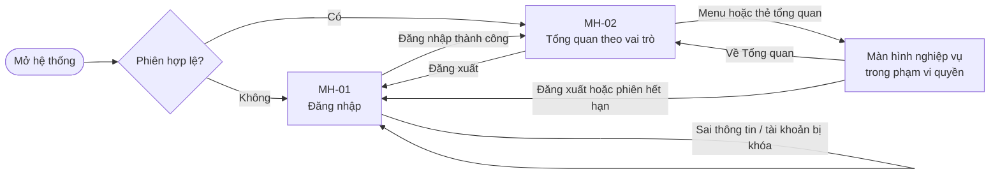
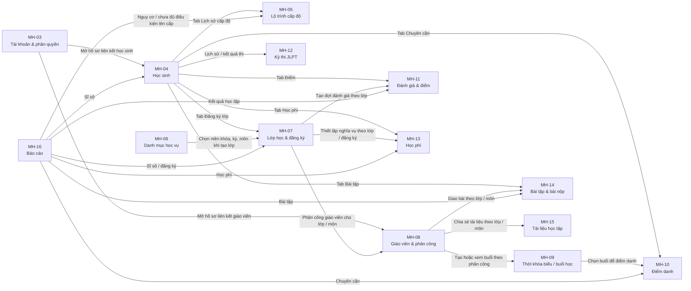

# Sơ đồ di chuyển giữa các màn hình

Tài liệu này được tổng hợp từ `tai_lieu_man_hinh` và `tai_lieu_dac_ta/TAI_LIEU_DAC_TA_HE_THONG.md`.

## 1. Luồng tổng thể

## 2. Điều hướng từ Tổng quan

```mermaid
flowchart TB
    MH02["MH-02<br/>Tổng quan"]

    subgraph QT_NV["Quản trị viên / Nhân viên"]
        MH04["MH-04<br/>Học sinh"]
        MH07["MH-07<br/>Lớp học & đăng ký"]
        MH13["MH-13<br/>Học phí"]
        MH16["MH-16<br/>Báo cáo"]
    end

    subgraph GV["Giáo viên"]
        MH09["MH-09<br/>Thời khóa biểu / buổi học"]
        MH08["MH-08<br/>Giáo viên & phân công"]
        MH10["MH-10<br/>Điểm danh"]
        MH14["MH-14<br/>Bài tập & bài nộp"]
    end

    subgraph HS["Học sinh"]
        HS09["MH-09<br/>Lịch học cá nhân"]
        HS10["MH-10<br/>Chuyên cần cá nhân"]
        HS14["MH-14<br/>Bài tập của tôi"]
        MH11["MH-11<br/>Điểm / kết quả cá nhân"]
        MH15["MH-15<br/>Tài liệu học tập"]
    end

    MH02 -->|Sĩ số| MH04
    MH02 -->|Lớp đang hoạt động| MH07
    MH02 -->|Công nợ| MH13
    MH02 -->|Doanh thu| MH16
    MH02 -->|Học sinh có nguy cơ| MH16

    MH02 -->|Buổi học sắp tới| MH09
    MH02 -->|Lớp / môn được phân công| MH08
    MH02 -->|Điểm danh cần xử lý| MH10
    MH02 -->|Bài tập cần xử lý| MH14

    MH02 -->|Lịch học gần nhất| HS09
    MH02 -->|Tỷ lệ chuyên cần| HS10
    MH02 -->|Bài tập cần nộp| HS14
    MH02 -->|Điểm gần nhất| MH11
    MH02 -->|Tài liệu mới| MH15
```

> Nhân viên chỉ thấy báo cáo được cấp quyền. Giáo viên chỉ thấy lớp/môn được phân công. Học sinh chỉ thấy dữ liệu cá nhân và lớp đang tham gia.

## 3. Luồng nghiệp vụ liên màn hình

Các mũi tên từ MH-06, MH-07 và MH-08 biểu diễn luồng nghiệp vụ hợp lý theo dữ liệu đầu vào của màn hình kế tiếp. Khi triển khai menu hoặc nút tắt, trang đích vẫn phải kiểm tra quyền độc lập.

## 4. Ma trận màn hình theo vai trò

| Vai trò | Màn hình có thể truy cập |
| --- | --- |
| Quản trị viên | MH-02 đến MH-16, theo toàn bộ quyền quản trị |
| Nhân viên | MH-02, MH-04 đến MH-10, MH-12, MH-13 và MH-16 khi được cấp quyền |
| Giáo viên | MH-02, MH-04 (chỉ xem), MH-07 (chỉ xem), MH-09 đến MH-12, MH-14 đến MH-16 trong phạm vi phân công |
| Học sinh | MH-02, MH-04 (hồ sơ cá nhân), MH-07 (lớp liên quan), MH-09 đến MH-15 với dữ liệu cá nhân/đã công bố |

MH-01 là màn hình công khai trước xác thực. Khi phiên hết hạn, bị thu hồi hoặc tài khoản bị khóa, người dùng được đưa về MH-01.
